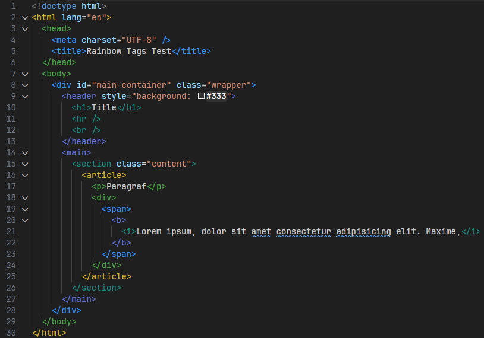
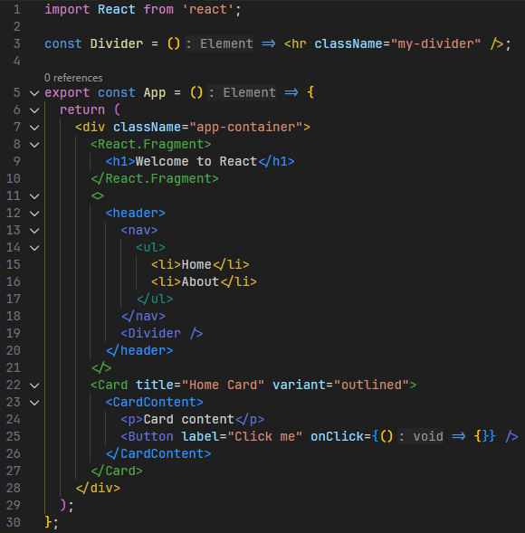
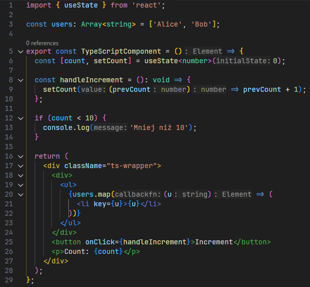

# Rainbow Tags Extended

Rainbow (WebStorm-like) colors for HTML / JSX / TSX tags using VS Code decorations. Only the `<`, tag name, and `>`/`/>` are colored; attributes and values keep the theme colors. Depth-based cycling with user-defined palette and ignored tags.

## Background

- Built primarily for my own use: I normally work in WebStorm where tag coloring is enabled by default. While AI coding (Cursor/Copilot) is attractive and student status gives me free access to this tools, I wanted the same rainbow tag UX in VS Code and VS Code forks.
- Inspired by extensions (JetBrains Rainbow Brackets Rainbow Tags).
- Possible future additions: optional colored indent guides to mirror the bracket/tag colors.

## Features

- Nesting-based rainbow colors; same depth → same color.
- Works in `html`, `javascriptreact` (JSX), `typescriptreact` (TSX).
- React fragments supported: `<>...</>` and `React.Fragment`.
- Self-closing tags handled; depth pops immediately.
- Skips TypeScript generics and common false-positives.
- Ignores tags inside JS/TS comments and HTML comments.
- Settings:
  - `rainbowTagsExtended.colors`: array of hex colors (cycled by depth).
  - `rainbowTagsExtended.ignoredTags`: array of tag names to skip (case-insensitive).

## Requirements

- Node.js (for build)
- `vsce` installed globally (for packaging)  
  `npm install -g vsce`

## Install (from source)

```bash
npm install
npm run compile
vsce package
# produces rainbow-tags-extended-0.1.0.vsix
code --install-extension rainbow-tags-extended-0.1.0.vsix
```

Reload VS Code after installation.

## Examples

HTML


JSX


TSX


## Settings examples (`settings.json`)

```json
{
  "rainbowTagsExtended.colors": ["#ff5555", "#ffb86c", "#f1fa8c", "#50fa7b", "#8be9fd", "#bd93f9", "#ff79c6"],
  "rainbowTagsExtended.ignoredTags": ["script", "style"]
}
```

## Usage

- Open any `.html`, `.jsx`, or `.tsx` file; colors apply automatically.
- Only tag brackets and names are colored; attributes remain untouched.

## Development

- Watch mode: `npm run watch`
- Entry point: `src/extension.ts`
- Activation events: `onLanguage:html`, `onLanguage:javascriptreact`, `onLanguage:typescriptreact`

## Notes on parsing and false-positives

- Tag names must start with a letter or `_`; prevents coloring expressions like `count < 10`.
- Skips generics/arrow bodies in attributes by tracking `{...}` blocks and `<...>` generic sections, so `=>` or generic type args do not terminate tags early.
- Comments (`//`, `/* */`, `<!-- -->`) and strings are ignored when scanning.
